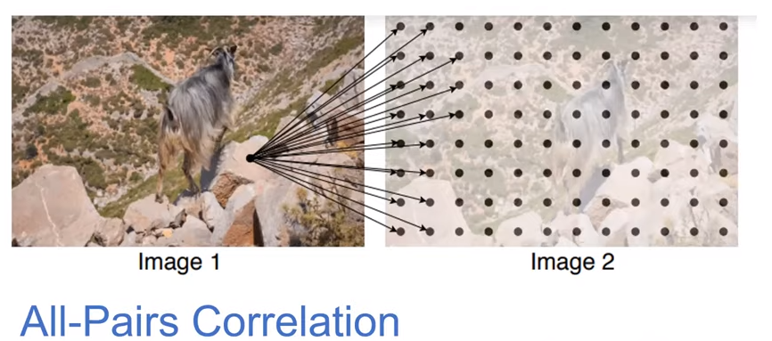

# DROID-SLAM

Conference: NIPS21
Date of first release: 2021.08

### RAFT: Recurrent All-Pairs Field Transform

(ECCV-2020 Best paper award), **Supervised**

- To create a **measure of visual similarity,**
    - they are finding **All-Pairs Correlation**. It is a 4D correlation volume, since every pixel of one image is correlated with every pixel in the second image.
    
    
    
    But not doing for raw image, but for the features of the image (at 1/8th resolution of the actual img)
    
    
    
    - doing optical flow refinements, by looking at the current estimate of the optical flow, context features and Lookup from the correlation volume.
    
    
    
    - so whole n/w is working at the 1/8th resolution.
    
- **How to do Lookup from correlation volume? :** Make a Correlation Pyramid by Avg pool last two diamensions of 4D volume.
    
    which smears out the high confidence activations of the 4D volume.
    
       
    
    
    
    - Sampling from high resolution means it corresponds to small displacements (less motion), Sampling from coercer resolution means it corresponds to large displacements (less motion) and make large corrections to the optical flow.
        
        After some updates, we have to make just small updates, so we will be using only first(high res) level of pyramid.
        
    
- They use Conv GRU update operator to mimic iterative updates of a first order optimization algorithm.
    
    So, correlation features are used to do the update instead of gradients.
    
    **RAFT is Supervised** 
    
    
    
- **Trained** on Synthetic Datasets. then **fine tuned** on Real life datasets(kitti , sintel)
- Visually, there optical flow for a video was temporally consistent.
- storing the full correlation volume eats up a lot of GPU memory. But computation wise it is just 20%. But they have a low memory implementation also where they store correl volume at coercer resolution.

### RAFT-Stereo

(3DV 2021)

Stereo matching is 1D analog of Optical Flow, And Scene flow is 3D analog of Optical flow.

Here, we will just have a 3D correlation volume, because for a pixel we have to take the correlation with only a horizontal line(not all pixels) in the other image.

Their pcd from the predicted depth is very good.

## DROID-SLAM

We can find optical flow if we have depth and camera poses:

So here: given the **optical flow**(using RAFT), we want to compute the **depth and camera poses.**

> DBA: find pixelwise depth and camera poses that are consistent with predicted flow(RAFT).
> 

Covisibility graph: edges b/w the frames that have some visual overlap.

 

- flow revisions are the update to predicted flow(RAFT output)

this is a least square optimisation problem, we can linearize it and solve it.

- Supervised on pose loss and flow loss.
- Trained on Monocular. No retraining is required for Stereo and RGB-D.

From their trajectory results from TartanAir dataset, if the trajectory has loop closures, then they have near to 0 drift, but if no loop closure is there, then a little drift can be seen.

- Results
    
    
    
    
    
    
    
    
    
    
    

### What problem is the author trying to solve?

Fully differentiable Realtime Visual SLAM system for Monocular videos (works on stereo and RGB-D also). 

### How are they better than the previous methods?

- **high Accuracy** (large improvements over prior work: both learning based as well as Classical methods),
- **High Robustness** (less catastrophic failures),
- **Strong cross-dataset generalization** (trained on monocular TartanAir, tested on all other be it stereo or rgbd also).

### Proposed Method :

General idea they have applied to solve for Optical flow, Stereo Matching, SLAM and Scene flow:

- Supervised using pose loss and flow loss( b/w gt_flow AND predicted_flow(which is getting updated using flow revisions) ).
- During Inference, the depth and the camera poses will get iteratively updated as new frames are processed.
- **Initialisation**: make frame graph for first 12 keyframes(mean optical flow> 16px) in which keyframes have edges if they are 3 timesteps apart. Then do 10 update iterations.
- **Frontend:** After that, **process** each frame and add it to the covisibility graph. Make edges with 3 closest neighbours as measured by mean optical flow. The depth and the camera poses for each pair (i,j) will get iteratively updated as new frames are processed.
- After adding a keyframe, remove one keyframe (redundant one or the oldest one). **So Frontend also have 12 frames always.**
- **Keyframe selection**: mean optical flow should be > 4px(estimated by applying one update iteration).
- **Covisible Keyframe selection** in covisibility graph:
    - mean optical flow should be > 16px for frontend.
    - mean optical flow should be >22px for backend.
- For each image pair (i,j) in covisibility graph, make a 4D correlation volume from their feature maps.
    - how to make lookup in correlation volume?
        - make a dense correspondence field(p_ij) of size HxWx2 (which gives the pixel locations of image_j for every pixel locations of image_i).
        - Use of the correspondence field(p_ij):
            - to index the correlation volume OR to do the lookup in the correl volume.
            - to estimate the optical flow. i.e., p_ij - p_j
- after each depth,camera pose update, update the covisibility graph.

- Memory Requirements:
    
    frontend = 8GB
    backend : TUM-RGBD ( 1 1 GB)
    EuRoC, TartanAIr, ETH-3D (24GB)
    
